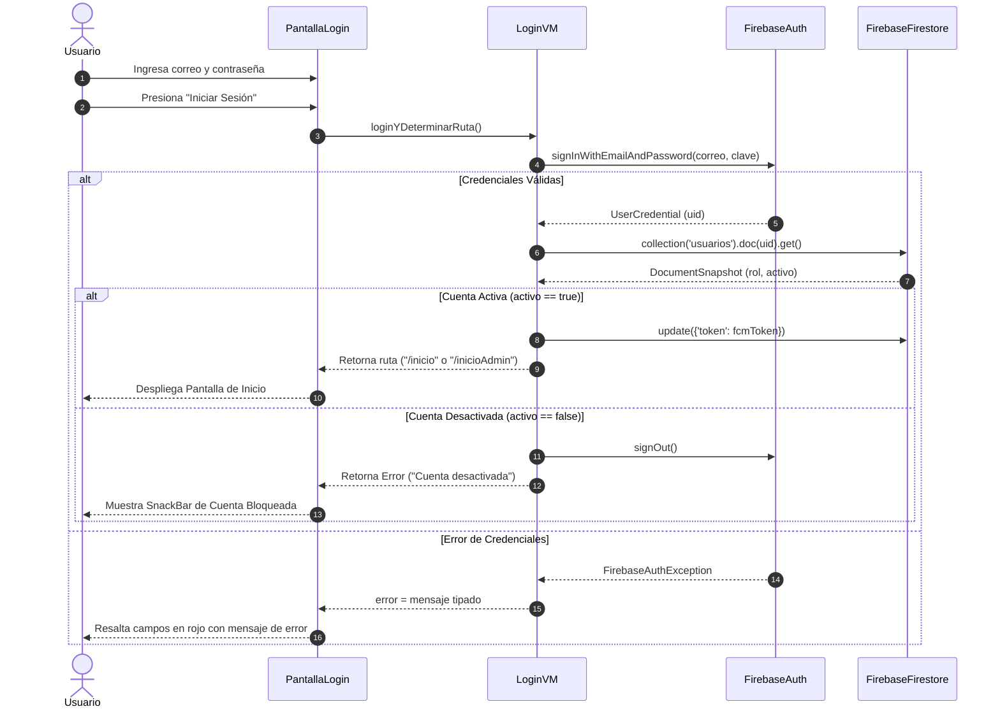
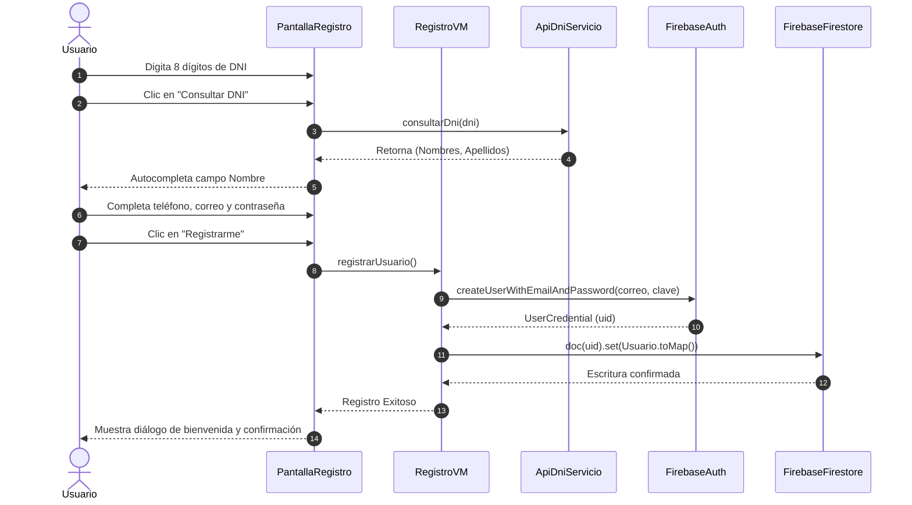
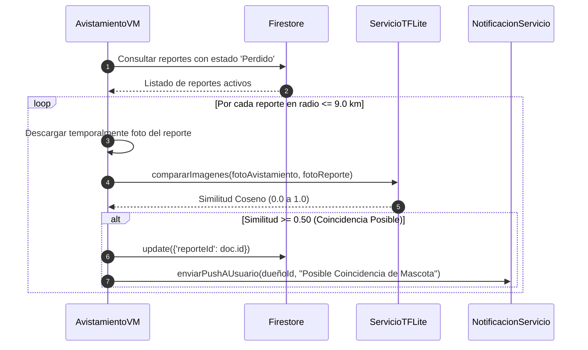
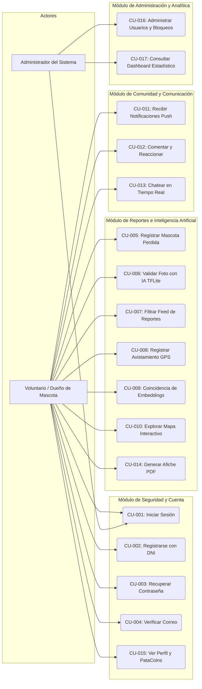

# UNIVERSIDAD PRIVADA DE TACNA
## FACULTAD DE INGENIERÍA
### Escuela Profesional de Ingeniería de Sistemas

---

# PLAN DE ITERACIÓN
## Fase de Construcción – Iteración 01

**Proyecto:**  
*"Aplicación móvil colaborativa para mejorar la efectividad en la asistencia de mascotas perdidas con participación de voluntarios en la ciudad de Tacna, 2026"*  
**Nombre del Sistema:** *SOS Mascota* (`sos_mascotas`)

**Curso:** Construcción de Software II  
**Docente:** Mag. Ricardo Eduardo Valcárcel Alvarado  
**Ciclo:** Séptimo Ciclo  
**Grupo de Desarrollo:** Grupo de Proyecto SOS Mascota  
**Autores:** Equipo de Desarrollo de Software UPT  
**Tacna – Perú, 2026**  

---

## Tabla de Contenido

1. [Propósito del Documento](#1-propósito-del-documento)
2. [Referencias](#2-referencias)
3. [Requerimientos Funcionales del Sistema (17 Requerimientos Exhaustivos)](#3-requerimientos-funcionales-del-sistema)
   - [4.1 RF-001: Autenticación de Usuario (Login Seguro)](#41-rf-001-autenticación-de-usuario-login-seguro)
   - [4.2 RF-002: Registro de Usuarios con Consulta y Validación de DNI](#42-rf-002-registro-de-usuarios-con-consulta-y-validación-de-dni)
   - [4.3 RF-003: Recuperación y Restablecimiento de Contraseña](#43-rf-003-recuperación-y-restablecimiento-de-contraseña)
   - [4.4 RF-004: Verificación de Cuenta mediante Correo Electrónico](#44-rf-004-verificación-de-cuenta-mediante-correo-electrónico)
   - [4.5 RF-005: Registro de Reporte de Mascota Perdida (Formulario Wizard en 3 Pasos)](#45-rf-005-registro-de-reporte-de-mascota-perdida-formulario-wizard-en-3-pasos)
   - [4.6 RF-006: Validación y Clasificación de Imágenes con IA Local (TensorFlow Lite)](#46-rf-006-validación-y-clasificación-de-imágenes-con-ia-local-tensorflow-lite)
   - [4.7 RF-007: Visualización y Filtrado de Reportes de Mascotas (Feed Principal)](#47-rf-007-visualización-y-filtrado-de-reportes-de-mascotas-feed-principal)
   - [4.8 RF-008: Registro de Avistamiento de Mascota con Geolocalización GPS](#48-rf-008-registro-de-avistamiento-de-mascota-con-geolocalización-gps)
   - [4.9 RF-009: Algoritmo de Coincidencia Inteligente y Similitud Coseno de Embeddings](#49-rf-009-algoritmo-de-coincidencia-inteligente-y-similitud-coseno-de-embeddings)
   - [4.10 RF-010: Visualización de Mascotas en Mapa Interactivo (OpenStreetMap / Leaflet)](#410-rf-010-visualización-de-mascotas-en-mapa-interactivo-openstreetmap--leaflet)
   - [4.11 RF-011: Sistema de Notificaciones Push y Alertas Comunitarias (FCM)](#411-rf-011-sistema-de-notificaciones-push-y-alertas-comunitarias-fcm)
   - [4.12 RF-012: Sistema de Comentarios, Reacciones y Respuestas en Hilos](#412-rf-012-sistema-de-comentarios-reacciones-y-respuestas-en-hilos)
   - [4.13 RF-013: Mensajería Privada y Chat en Tiempo Real entre Usuarios](#413-rf-013-mensajería-privada-y-chat-en-tiempo-real-entre-usuarios)
   - [4.14 RF-014: Generación y Exportación de Cartel de Búsqueda en Formato PDF](#414-rf-014-generación-y-exportación-de-cartel-de-búsqueda-en-formato-pdf)
   - [4.15 RF-015: Gestión de Perfil de Usuario y Monedero de Recompensas (PataCoins)](#415-rf-015-gestión-de-perfil-de-usuario-y-monedero-de-recompensas-patacoins)
   - [4.16 RF-016: Panel de Administración, Moderación de Usuarios y Control de Roles](#416-rf-016-panel-de-administración-moderación-de-usuarios-y-control-de-roles)
   - [4.17 RF-017: Dashboard Estadístico y Métricas Generales del Sistema](#417-rf-017-dashboard-estadístico-y-métricas-generales-del-sistema)
4. [Planificación Cronológica de Tareas (Metodología SCRUM)](#4-planificación-cronológica-de-tareas-metodología-scrum)
5. [Casos de Uso y Escenarios del Sistema](#5-casos-de-uso-y-escenarios-del-sistema)
6. [Recursos de Software y Hardware](#6-recursos-de-software-y-hardware)
   - [Tabla 01: Recursos de Software](#tabla-01-recursos-de-software)
   - [Tabla 02: Recursos de Hardware](#tabla-02-recursos-de-hardware)
7. [Evaluación de la Iteración](#7-evaluación-de-la-iteración)
   - [Objetivos Alcanzados](#objetivos-alcanzados)
   - [Objetivos No Alcanzados](#objetivos-no-alcanzados)
   - [Elementos Incluidos en la Línea Base](#elementos-incluidos-en-la-línea-base)
8. [Conclusiones](#8-conclusiones)
9. [Plan de Próximas Iteraciones](#9-plan-de-próximas-iteraciones)
10. [Estado del Repositorio y Trazabilidad](#10-estado-del-repositorio-y-trazabilidad)

---

## 1. Propósito del Documento

El propósito de este documento es establecer de manera detallada las actividades, tareas, especificaciones de arquitectura, casos de uso, diagramas de interacción, interfaces gráficas, controles de pantalla y evidencias técnicas que se llevan a cabo durante la presente iteración correspondiente al proyecto **"Aplicación móvil colaborativa para mejorar la efectividad en la asistencia de mascotas perdidas con participación de voluntarios en la ciudad de Tacna, 2026"**.

Este plan sirve como guía formal de ingeniería para la ejecución de la iteración en el marco de la metodología ágil SCRUM y el estándar RUP/OpenUP, definiendo los objetivos específicos, criterios de aceptación medibles, modelos de datos y prototipos funcionales a implementar. Asimismo, proporciona un marco de control de calidad para verificar la trazabilidad entre los 17 requerimientos funcionales del sistema, el código fuente desarrollado en Flutter/Dart, la integración de servicios en Firebase (Authentication, Cloud Firestore, Cloud Storage, Cloud Messaging) y los modelos de visión artificial en el dispositivo móvil con TensorFlow Lite.

---

## 2. Referencias

Para la elaboración del presente Plan de Iteración se han tomado en cuenta los siguientes documentos y estándares de ingeniería:
* Documento de Especificación de Requerimientos de Software (SRS) de SOS Mascota.
* Documento de Arquitectura de Software (SAD) – Modelo de Vistas C4 y Arquitectura MVVM Reactiva.
* Plan de Desarrollo del Proyecto de Software (PDP).
* Plan de Gestión de Configuraciones y Repositorio Git.
* Plan de Aseguramiento de la Calidad del Software (SQA).
* Guía de Buenas Prácticas y Auditoría de Código Limpio de la Escuela de Ingeniería de Sistemas (UPT).

---

## 3. Requerimientos Funcionales del Sistema

A continuación se detalla la especificación exhaustiva de los **17 requerimientos funcionales** del sistema SOS Mascota, incluyendo para cada uno su ficha de caso de uso, narrativa paso a paso, flujo de excepciones, descripción de interfaz, controles de pantalla y marco de evidencias técnicas.

---

### 4.1 RF-001: Autenticación de Usuario (Login Seguro)

#### Descripción
Este requerimiento es esencial para la seguridad y control de acceso del sistema, ya que garantiza que únicamente usuarios autenticados (voluntarios, dueños de mascotas y administradores) puedan interactuar con la plataforma. La autenticación se basa en Firebase Authentication para el manejo criptográfico de sesiones, articulado con una verificación reactiva en tiempo real en Cloud Firestore (`auth_wrapper.dart`) para garantizar que la cuenta del usuario no se encuentre suspendida o desactivada por moderación.

#### Objetivos
* Autenticar credenciales de usuario mediante correo electrónico y contraseña de manera cifrada.
* Verificar en tiempo real el estado activo de la cuenta (`activo == true`) antes de autorizar la navegación.
* Diferenciar dinámicamente los roles de acceso (`usuario` vs `admin`) para dirigir al actor a su entorno correspondiente.
* Mantener la persistencia segura de la sesión tras el reinicio del aplicativo en el dispositivo móvil.

#### Criterios de Evaluación
* Credenciales válidas y cuenta activa otorgan acceso inmediato al feed principal o panel administrativo en menos de 2 segundos.
* Contraseña incorrecta o usuario no registrado devuelven mensajes claros y precisos sin revelar vulnerabilidades del sistema.
* Si el documento del usuario en Firestore tiene `activo == false`, el sistema cierra la sesión inmediatamente y muestra una alerta modal de bloqueo.
* La sesión se mantiene abierta entre reinicios del dispositivo sin requerir reingreso de contraseña.

#### Elementos de la Línea Base
* Narrativa del caso de uso de autenticación.
* Diagrama de secuencia de autenticación con verificación de estado.
* Código fuente: `lib/vista/auth/pantalla_login.dart`, `lib/vistamodelo/auth/login_vm.dart`, `lib/utils/auth_wrapper.dart`.

#### Caso de Uso CU-001: Iniciar Sesión

| Parámetro | Especificación |
| :--- | :--- |
| **Actor Principal** | Usuario Voluntario / Administrador |
| **Descripción** | Permite iniciar sesión de forma segura mediante correo electrónico y contraseña validados en Firebase. |
| **Precondición** | El usuario debe estar registrado previamente en Firebase Authentication y existir en Firestore. |
| **Poscondición** | El usuario ingresa a la vista principal según su rol (`/inicio` o `/inicioAdmin`) y su token FCM se actualiza. |

##### Narrativa del Caso de Uso

| Paso | Acción del Actor | Respuesta del Sistema |
| :---: | :--- | :--- |
| 1 | El usuario abre la aplicación móvil y se ubica en la pantalla de inicio de sesión. | El sistema muestra la interfaz de login con campos para correo electrónico, contraseña, botón conmutador de visibilidad, enlace de recuperación y botón "Iniciar Sesión". |
| 2 | El usuario ingresa su correo electrónico y su contraseña, y presiona el botón "Iniciar Sesión". | El sistema activa el indicador visual de carga (`cargando = true`) e invoca a `LoginVM.loginYDeterminarRuta()`. |
| 3 | | El sistema valida las precondiciones con `formKey.currentState!.validate()`. |
| 4 | | El sistema envía las credenciales a Firebase Authentication mediante `signInWithEmailAndPassword()`. |
| 5 | | Firebase Auth valida las credenciales y devuelve la credencial con el identificador único UID. |
| 6 | | El sistema consulta el documento del usuario en Firestore (`collection('usuarios').doc(uid)`). |
| 7 | | El sistema comprueba que el documento exista y que el campo `activo` sea verdadero. |
| 8 | | El sistema actualiza en segundo plano el token de notificaciones FCM asociado al UID. |
| 9 | | El sistema redirige al usuario: si su rol es `admin` se envía a `/inicioAdmin`; si es `usuario` se envía a `/inicio`. |

##### Flujo de Excepciones

| Código | Condición de Fallo | Respuesta del Sistema |
| :---: | :--- | :--- |
| **E1** | Correo no registrado (`user-not-found`) | El sistema captura `FirebaseAuthException`, desactiva el cargando y muestra: "Usuario no existe. Verifique sus datos o regístrese". |
| **E2** | Contraseña incorrecta (`wrong-password` o `invalid-credential`) | El sistema muestra el mensaje de error: "Contraseña incorrecta". El campo de contraseña se resalta en color rojo. |
| **E3** | Cuenta desactivada (`activo == false`) | El sistema expulsa la sesión mediante `FirebaseAuth.instance.signOut()`, redirige a la pantalla de login y despliega un SnackBar flotante rojo con el mensaje: "Tu cuenta ha sido desactivada por el administrador". |
| **E4** | Tiempo de espera agotado (sin internet) | Tras 15 segundos sin respuesta, se interrumpe la petición con `TimeoutException` y se informa: "Tiempo de espera agotado. Verifique su conexión a internet". |

*Fuente: Elaboración propia del equipo de trabajo.*

#### Diagrama de Secuencia



#### Especificación de Interfaz y Controles de Pantalla
* **Ruta de Código:** `lib/vista/auth/pantalla_login.dart`.
* **Controles Visuales:**
  * Campo de Texto `txtCorreo`: Validación de formato RFC 5322 con icono de sobre.
  * Campo de Texto `txtClave`: Campo con máscara de contraseña y botón conmutador de visibilidad.
  * Botón de Acción `btnLogin`: Botón elevado con indicador de progreso circular (`CircularProgressIndicator`) durante el procesamiento asíncrono.
  * Botón Secundario `btnRecuperar`: Enlace directo a `PantallaRecuperar`.
  * Botón Secundario `btnRegistrarse`: Enlace directo a `PantallaRegistro`.

#### Evidencias Técnicas Requeridas
* **Figura 4.1.1:** *Captura de Pantalla - Interfaz de Inicio de Sesión de SOS Mascota.*
* **Figura 4.1.2:** *Captura de Pantalla - Validación de Credenciales Incorrectas y Manejo de Errores.*
* **Figura 4.1.3:** *Evidencia de Base de Datos - Registro de Usuario y Token FCM en Cloud Firestore.*

---

### 4.2 RF-002: Registro de Usuarios con Consulta y Validación de DNI

#### Descripción
Permite a nuevos voluntarios y ciudadanos registrarse en la plataforma ingresando su Documento Nacional de Identidad (DNI) de 8 dígitos. El sistema consulta en tiempo real el servicio de la API de RENIEC (`miapi.cloud`), extrayendo de forma fidedigna los nombres y apellidos del titular, impidiendo la suplantación de identidades y poblando automáticamente la base de datos de voluntarios en Tacna.

#### Objetivos
* Validar que todo usuario registrado cuente con identidad ciudadana peruana verificada.
* Reducir errores de digitación autocompletando nombres y apellidos oficiales.
* Crear la cuenta en Firebase Authentication y el registro de perfil en Cloud Firestore con rol inicial de voluntario.

#### Criterios de Evaluación
* El ingreso de un DNI de 8 dígitos consulta la API y completa automáticamente los nombres en menos de 2 segundos.
* No se permite continuar si el DNI es inválido o no existe en el padrón de RENIEC.
* La cuenta se crea con saldo inicial de 0 PataCoins y estado activo verificado.

#### Caso de Uso CU-002: Registro de Usuario con DNI

| Parámetro | Especificación |
| :--- | :--- |
| **Actor Principal** | Nuevo Usuario / Voluntario |
| **Descripción** | Registro de cuenta personal validando identidad contra el padrón nacional de DNI. |
| **Precondición** | El usuario no debe estar registrado previamente con el mismo DNI ni correo electrónico. |
| **Poscondición** | Se crea la cuenta en Firebase Auth y el documento de perfil en Firestore. |

##### Narrativa del Caso de Uso

| Paso | Acción del Actor | Respuesta del Sistema |
| :---: | :--- | :--- |
| 1 | El usuario selecciona la opción "¿No tienes cuenta? Regístrate" en la pantalla de login. | El sistema abre `PantallaRegistro` mostrando el formulario de alta. |
| 2 | El usuario ingresa su número de DNI (8 dígitos numéricos) y presiona el botón "Consultar DNI". | El sistema invoca a `ApiDniServicio.consultarDni(dni)`. |
| 3 | | La API valida el token Bearer y consulta el padrón de identidad. |
| 4 | | El sistema recibe el JSON con `nombres`, `apellidoPaterno` y `apellidoMaterno`. |
| 5 | | El sistema concatena y completa automáticamente el campo "Nombre Completo" y bloquea su edición manual. |
| 6 | El usuario ingresa su número de celular, correo electrónico y contraseña deseada. | El sistema valida que el teléfono tenga 9 dígitos y la contraseña tenga mínimo 6 caracteres. |
| 7 | El usuario presiona el botón "Registrarme". | El sistema invoca `RegistroVM.registrarUsuario()`. |
| 8 | | El sistema crea el usuario en Firebase Auth (`createUserWithEmailAndPassword`). |
| 9 | | El sistema crea el documento en Firestore (`collection('usuarios').doc(uid).set(...)`) con datos validados. |
| 10 | | El sistema envía un correo de verificación y redirige al usuario a la pantalla de confirmación. |

##### Flujo de Excepciones
* **E1 - DNI no encontrado:** Si la API devuelve código 404 o `success: false`, se muestra: "DNI no encontrado en el padrón electoral. Verifique el número ingresado".
* **E2 - Correo ya registrado:** Si Firebase Auth devuelve `email-already-in-use`, el sistema resalta el campo de correo con el mensaje "Este correo ya se encuentra registrado".
* **E3 - Falla de conexión a la API:** Si el endpoint no responde, se notifica al usuario para que reintente la consulta.

#### Diagrama de Secuencia



#### Especificación de Interfaz y Controles de Pantalla
* **Ruta de Código:** `lib/vista/auth/pantalla_registro.dart`.
* **Controles Visuales:**
  * Campo Numérico `txtDni`: 8 dígitos, teclado numérico forzado.
  * Botón de Consulta `btnConsultarDni`: Desencadena consumo de API REST.
  * Campo de Solo Lectura `txtNombreCompleto`: Autocompletado desde API RENIEC.
  * Campo Telefónico `txtTelefono`: 9 dígitos comenzando con 9.
  * Campos `txtCorreo`, `txtClave` y `txtConfirmarClave`.
  * Botón de Envío `btnRegistrar`: Validador integral de formulario.

#### Evidencias Técnicas Requeridas
* **Figura 4.2.1:** *Captura de Pantalla - Formulario de Registro con Autocompletado de DNI.*
* **Figura 4.2.2:** *Captura de Pantalla - Respuesta de la API DNI y Poblado Automático de Nombres.*
* **Figura 4.2.3:** *Evidencia de Base de Datos - Documento de Usuario Creado en Firestore con Rol `usuario`.*

---

### 4.3 RF-003: Recuperación y Restablecimiento de Contraseña

#### Descripción
Permite a cualquier usuario que haya olvidado su clave de acceso solicitar un enlace de restablecimiento seguro ingresando el correo electrónico asociado a su cuenta. El enlace es despachado de forma asíncrona mediante los servidores de Firebase Authentication.

#### Objetivos
* Proveer autoservicio de recuperación de acceso las 24 horas sin intermediación administrativa.
* Prevenir ataques de fuerza bruta limitando las solicitudes consecutivas de restablecimiento.

#### Criterios de Evaluación
* El sistema valida la sintaxis del correo antes de emitir la petición a Firebase.
* Correo válido recibe el enlace de recuperación en su bandeja de entrada en menos de 60 segundos.
* Se informa al usuario mediante un diálogo modal que revise su carpeta de spam o correo no deseado.

#### Caso de Uso CU-003: Recuperar Contraseña

| Parámetro | Especificación |
| :--- | :--- |
| **Actor Principal** | Usuario Voluntario |
| **Descripción** | Envío de correo electrónico con enlace para restablecer la contraseña de acceso. |
| **Precondición** | La cuenta debe existir previamente en Firebase Authentication. |
| **Poscondición** | Firebase Auth despacha el correo seguro de restablecimiento. |

##### Narrativa del Caso de Uso

| Paso | Acción del Actor | Respuesta del Sistema |
| :---: | :--- | :--- |
| 1 | El usuario presiona "¿Olvidaste tu contraseña?" en `PantallaLogin`. | El sistema navega hacia `PantallaRecuperar`. |
| 2 | El usuario ingresa su dirección de correo electrónico registrado. | El sistema valida el formato de correo. |
| 3 | El usuario presiona el botón "Enviar Enlace de Recuperación". | El sistema invoca `RecuperarVM.enviarCorreoRecuperacion()`. |
| 4 | | El sistema invoca `FirebaseAuth.instance.sendPasswordResetEmail(email)`. |
| 5 | | Firebase Auth procesa el envío del correo criptográfico. |
| 6 | | El sistema muestra un diálogo de confirmación y redirige a la pantalla de login. |

##### Flujo de Excepciones
* **E1 - Correo no registrado:** Se muestra alerta informativa: "No se encontró ninguna cuenta asociada a este correo electrónico".
* **E2 - Límite de peticiones excedido (`too-many-requests`):** Se bloquea temporalmente el envío y se informa: "Demasiadas solicitudes. Espere unos minutos antes de reintentar".

#### Especificación de Interfaz y Controles de Pantalla
* **Ruta de Código:** `lib/vista/auth/pantalla_recuperar.dart`.
* **Controles Visuales:**
  * Campo de Texto `txtCorreoRecuperacion`: Validador de correo.
  * Botón `btnEnviarEnlace`: Envío asíncrono con `CircularProgressIndicator`.
  * Diálogo Modal `dlgConfirmacion`: Mensaje de éxito e instrucciones de bandeja de entrada.

#### Evidencias Técnicas Requeridas
* **Figura 4.3.1:** *Captura de Pantalla - Pantalla de Recuperación de Contraseña.*
* **Figura 4.3.2:** *Captura de Pantalla - Diálogo de Envío Exitoso de Correo de Restablecimiento.*

---

### 4.4 RF-004: Verificación de Cuenta mediante Correo Electrónico

#### Descripción
Envía un mensaje de confirmación con enlace criptográfico al correo del usuario recién registrado, impidiendo que cuentas sin validar puedan publicar recompensas económicas o adoptar animales en la comunidad.

#### Objetivos
* Eliminar el registro masivo de cuentas con correos falsos o inexistentes.
* Validar la propiedad de la casilla de correo electrónico del voluntario.

#### Criterios de Evaluación
* El sistema detecta en tiempo real cuando el enlace ha sido pulsado mediante un sondeo periódico de `currentUser.reload()`.
* Redirige automáticamente al feed principal una vez verificada la cuenta.

#### Caso de Uso CU-004: Verificar Correo Electrónico

| Parámetro | Especificación |
| :--- | :--- |
| **Actor Principal** | Nuevo Usuario Registrado |
| **Descripción** | Verificación obligatoria de propiedad de correo electrónico. |
| **Precondición** | Usuario recién creado con `emailVerified == false`. |
| **Poscondición** | La cuenta cambia a estado verificado y accede al sistema. |

##### Narrativa del Caso de Uso

| Paso | Acción del Actor | Respuesta del Sistema |
| :---: | :--- | :--- |
| 1 | El usuario culmina el registro de cuenta. | El sistema detecta `emailVerified == false` y abre `PantallaVerificaEmail`. |
| 2 | | El sistema despacha el correo de verificación e inicia un temporizador de sondeo cada 3 segundos. |
| 3 | El usuario abre su aplicación de correo y presiona el enlace de verificación recibido. | Firebase Authentication actualiza el atributo `emailVerified = true`. |
| 4 | | El temporizador de la app detecta la actualización al ejecutar `currentUser.reload()`. |
| 5 | | El sistema cancela el temporizador y navega automáticamente al menú principal. |

##### Flujo de Excepciones
* **E1 - Correo no recibido:** El usuario puede pulsar el botón "Reenviar correo" transcurrido el tiempo de espera de 60 segundos.

#### Especificación de Interfaz y Controles de Pantalla
* **Ruta de Código:** `lib/vista/auth/pantalla_verifica_email.dart`.
* **Controles Visuales:**
  * Texto descriptivo con la dirección de correo a la que fue enviado el enlace.
  * Botón `btnReenviarEmail`: Con temporizador de enfriamiento de 60 segundos.
  * Botón `btnCancelar`: Cierra sesión y retorna al login.

#### Evidencias Técnicas Requeridas
* **Figura 4.4.1:** *Captura de Pantalla - Pantalla de Espera de Verificación de Correo Electrónico.*
* **Figura 4.4.2:** *Captura de Pantalla - Mensaje de Verificación Emitido por Firebase Auth en Bandeja de Correo.*

---

### 4.5 RF-005: Registro de Reporte de Mascota Perdida (Formulario Wizard en 3 Pasos)

#### Descripción
Permite a los usuarios dueños de mascotas registrar formalmente la desaparición de un animal mediante un formulario interactivo estructurado en tres etapas consecutivas (Wizard): Datos del animal y fotografía, Localización y circunstancias, y Recompensa con confirmación.

#### Objetivos
* Reducir la carga cognitiva del usuario organizando el proceso en pasos lógicos secuenciales.
* Almacenar fotografías de alta resolución en Firebase Storage vinculadas al identificador del reporte.
* Capturar las coordenadas exactas de latitud y longitud donde el animal fue visto por última vez en Tacna.

#### Caso de Uso CU-005: Registrar Mascota Perdida

| Parámetro | Especificación |
| :--- | :--- |
| **Actor Principal** | Dueño de Mascota / Usuario Autenticado |
| **Descripción** | Creación y publicación de una alerta de búsqueda geolocalizada en Tacna. |
| **Precondición** | Usuario con sesión activa y permisos de cámara/galería concedidos. |
| **Poscondición** | El reporte se almacena en Firestore, la imagen en Storage y se despacha notificación push comunitaria. |

##### Narrativa del Caso de Uso

| Paso | Acción del Actor | Respuesta del Sistema |
| :---: | :--- | :--- |
| 1 | El usuario presiona el botón flotante "Reportar Mascota Perdida" en el menú principal. | El sistema abre `PantallaReporteMascota` posicionándose en el **Paso 1: Datos de la Mascota**. |
| 2 | El usuario selecciona una foto desde su galería o toma una foto con la cámara. | El sistema invoca `ImagenUtil.validarYSubirFoto()` preprocesando la imagen con IA local (TFLite). |
| 3 | El usuario ingresa nombre, especie (perro, gato, otro), raza, sexo y señas particulares. | El sistema valida que los campos descriptivos obligatorios no estén vacíos. |
| 4 | El usuario presiona "Continuar". | El sistema valida el formulario del Paso 1 y avanza al **Paso 2: Ubicación y Fecha**. |
| 5 | El usuario selecciona el distrito de Tacna (ej. Gregorio Albarracín), dirección y toca el mapa para fijar el marcador GPS. | El sistema captura `latitud` y `longitud`, y formatea la fecha y hora de la pérdida. |
| 6 | El usuario presiona "Continuar". | El sistema avanza al **Paso 3: Recompensa y Confirmación**. |
| 7 | El usuario define la recompensa en dinero (S/.) y la bonificación en PataCoins (50 por defecto). | El sistema muestra el resumen general con el afiche preliminar de la mascota. |
| 8 | El usuario presiona "Publicar Reporte". | El sistema invoca `ReporteMascotaVM.guardarReporte()`, guarda en Firestore, dispara una notificación push global y redirige al feed. |

##### Flujo de Excepciones
* **E1 - Fotografía no válida:** Si TFLite determina que no hay un animal con confianza >= 0.60, se bloquea el avance y se muestra: "La imagen no corresponde a una mascota válida".
* **E2 - Coordenadas no seleccionadas:** Se impide avanzar al paso 3 hasta que el usuario fije un punto en el mapa de Tacna.

#### Especificación de Interfaz y Controles de Pantalla
* **Ruta de Código:** `lib/vista/reportes/pantalla_reporte_mascota.dart`.
* **Controles Visuales:**
  * Indicador de Progreso Wizard: Pasos 1, 2 y 3 con numeración activa.
  * Selector de Imagen: Botón con previsualización circular de la fotografía.
  * Controles de Entrada: Selectores desplegables (`Dropdown`) para especie, sexo y distrito.
  * Widget de Mapa: Vista interactiva para fijar marcador geográfico de pérdida.
  * Botones de Navegación: "Anterior", "Siguiente" y "Publicar Reporte".

#### Evidencias Técnicas Requeridas
* **Figura 4.5.1:** *Captura de Pantalla - Wizard Paso 1: Datos de la Mascota y Carga de Fotografía.*
* **Figura 4.5.2:** *Captura de Pantalla - Wizard Paso 2: Selección Geográfica en el Mapa de Tacna.*
* **Figura 4.5.3:** *Captura de Pantalla - Wizard Paso 3: Asignación de Recompensa y Confirmación.*
* **Figura 4.5.4:** *Evidencia de Base de Datos - Registro de Mascota en la Colección `reportes` de Firestore.*

---

### 4.6 RF-006: Validación y Clasificación de Imágenes con IA Local (TensorFlow Lite)

#### Descripción
Ejecuta de manera autónoma un modelo de visión computacional convolucional (MobileNet) en el propio teléfono móvil sin requerir internet para la inferencia. Analiza cada fotografía seleccionada por el usuario, detecta la presencia de mascotas (perros/gatos) y calcula el porcentaje de confianza, rechazando imágenes que no correspondan a animales.

#### Objetivos
* Blindar la base de datos contra la subida de imágenes basura, memes o fotos humanas.
* Extraer el vector matemático de 1280 dimensiones (embeddings) para el cotejo biométrico automatizado.

#### Criterios de Evaluación
* Inferencia ejecutada en menos de 500 ms en dispositivos de gama media.
* Confianza mínima requerida del 60% (`0.60`). Si es menor, se lanza `ValidationException`.

#### Caso de Uso CU-006: Inferencia de Visión Computacional On-Device

| Parámetro | Especificación |
| :--- | :--- |
| **Actor Principal** | Motor de Inteligencia Artificial (TFLite) |
| **Descripción** | Clasificación de imagen y extracción de vector de características numéricas en el dispositivo. |
| **Precondición** | Imagen seleccionada y modelo `.tflite` cargado en memoria RAM. |
| **Poscondición** | Retorna boolean de validación y vector de embeddings de 1280 dimensiones. |

##### Narrativa del Caso de Uso

| Paso | Acción del Actor | Respuesta del Sistema |
| :---: | :--- | :--- |
| 1 | El usuario selecciona una fotografía desde la galería o cámara. | El sistema invoca `ImagenUtil.validarYSubirFoto()`. |
| 2 | | `ServicioTFLite` redimensiona la imagen a 224x224 píxeles y normaliza valores RGB a matriz flotante `[1, 224, 224, 3]`. |
| 3 | | El intérprete ejecuta la inferencia de clasificación canina/felina. |
| 4 | | Si la confianza supera el umbral de 0.60, se ejecuta el modelo extractor de embeddings. |
| 5 | | Se genera el vector numérico de 1280 flotantes y se adjunta a la carga útil. |
| 6 | | La imagen se sube a Firebase Storage y el proceso continúa exitosamente. |

##### Flujo de Excepciones
* **E1 - Objeto no identificado o humano:** El clasificador arroja confianza menor a 0.60. Se interrumpe la subida con mensaje modal de advertencia al usuario.

#### Evidencias Técnicas Requeridas
* **Figura 4.6.1:** *Captura de Pantalla - Alerta de Imagen Rechazada por Clasificador de Inteligencia Artificial.*
* **Figura 4.6.2:** *Evidencia de Código - Inferencia Convolucional y Normalización de Tensores en `ServicioTFLite`.*

---

### 4.7 RF-007: Visualización y Filtrado de Reportes de Mascotas (Feed Principal)

#### Descripción
Despliega en tiempo real la lista cronológica de todas las mascotas extraviadas en la región de Tacna mediante una cuadrícula de tarjetas interactivas. Cada tarjeta incluye la imagen principal, el nombre del animal, el distrito, el tiempo transcurrido (hace X horas), el estado ("Perdido" o "Encontrado") y botones de acceso directo a la ficha completa, mapa y comentarios.

#### Objetivos
* Facilitar a la comunidad la identificación rápida de animales en búsqueda activa.
* Permitir filtros reactivos por distrito, especie (perros/gatos) y estado de resolución.

#### Criterios de Evaluación
* Los nuevos reportes publicados por otros usuarios aparecen en la pantalla sin necesidad de recargar la aplicación (Stream reactivo).
* El filtrado por distrito se realiza en memoria en menos de 100 ms.

#### Caso de Uso CU-007: Explorar y Filtrar Reportes

| Parámetro | Especificación |
| :--- | :--- |
| **Actor Principal** | Voluntario / Usuario General |
| **Descripción** | Visualización reactiva y filtrado multicriterio de las alertas de mascotas extraviadas. |
| **Precondición** | Conexión a internet y servicio Firestore accesible. |
| **Poscondición** | La interfaz despliega la lista filtrada de mascotas activas. |

##### Narrativa del Caso de Uso

| Paso | Acción del Actor | Respuesta del Sistema |
| :---: | :--- | :--- |
| 1 | El usuario ingresa a la pestaña "Reportes" en el menú inferior. | El sistema abre `PantallaVerReportes` y suscribe un `Stream` a la colección `reportes`. |
| 2 | | El sistema renderiza las tarjetas de mascotas con imagen, nombre, distrito y tiempo transcurrido. |
| 3 | El usuario pulsa el chip de filtro "Gatos" y selecciona el distrito "Tacna Centro". | El sistema filtra la lista en memoria y actualiza la cuadrícula al instante. |
| 4 | El usuario toca la tarjeta de una mascota específica. | El sistema navega a la vista de detalle con opciones de cartel PDF, comentarios y mapa. |

##### Flujo de Excepciones
* **E1 - No hay reportes que coincidan:** El sistema muestra una vista vacía amigable con el mensaje: "No se encontraron mascotas extraviadas con los filtros seleccionados".

#### Especificación de Interfaz y Controles de Pantalla
* **Ruta de Código:** `lib/vista/reportes/pantalla_ver_reportes.dart`.
* **Controles Visuales:**
  * Barra de Búsqueda de Texto: Búsqueda por nombre o raza.
  * Chips de Filtrado Rápido: "Todos", "Perros", "Gatos", "Otros".
  * Selector Desplegable de Distritos: Lista de los distritos de la provincia de Tacna.
  * Tarjetas de Mascota: Componente con imagen en caché (`CachedNetworkImage`), insignia de estado y botón de compartir.

#### Evidencias Técnicas Requeridas
* **Figura 4.7.1:** *Captura de Pantalla - Feed Principal de Reportes de Mascotas Extraviadas.*
* **Figura 4.7.2:** *Captura de Pantalla - Aplicación de Filtros por Especie y Distrito en Tacna.*

---

### 4.8 RF-008: Registro de Avistamiento de Mascota con Geolocalización GPS

#### Descripción
Permite a cualquier voluntario que observe una mascota desorientada en las calles de Tacna capturar una fotografía instantánea, obtener la posición GPS exacta del dispositivo móvil y registrar el avistamiento sin necesidad de conocer la identidad del dueño.

#### Objetivos
* Capturar avistamientos en menos de 15 segundos en situaciones de movilidad en la vía pública.
* Otorgar automáticamente 10 PataCoins al voluntario por cada avistamiento verificado.

#### Criterios de Evaluación
* Obtención de coordenadas con precisión menor a 15 metros mediante GPS satelital.
* Bonificación automática de PataCoins reflejada de inmediato en el perfil del usuario.

#### Caso de Uso CU-008: Registrar Avistamiento en Vía Pública

| Parámetro | Especificación |
| :--- | :--- |
| **Actor Principal** | Voluntario en Vía Pública |
| **Descripción** | Registro fotográfico y geolocalizado de un animal presuntamente extraviado. |
| **Precondición** | Sensor GPS activado y permisos de cámara concedidos. |
| **Poscondición** | Se guarda el avistamiento en Firestore, se otorgan 10 PataCoins y se activa el algoritmo de cotejo. |

##### Narrativa del Caso de Uso

| Paso | Acción del Actor | Respuesta del Sistema |
| :---: | :--- | :--- |
| 1 | El voluntario observa un animal en la vía pública y pulsa "Registrar Avistamiento". | El sistema abre `PantallaAvistamiento` y activa la geolocalización en segundo plano. |
| 2 | El voluntario presiona el botón de cámara y toma la fotografía del animal. | El sistema valida la fotografía con IA local (TFLite) y extrae sus coordenadas GPS. |
| 3 | El voluntario escribe una descripción breve (ej. "Cerca a la plaza de Pocollay, collar rojo"). | El sistema habilita el botón "Guardar Avistamiento". |
| 4 | El voluntario presiona "Guardar Avistamiento". | `AvistamientoVM.guardarAvistamiento()` persiste los datos en Firestore y Storage. |
| 5 | | El sistema abona automáticamente 10 PataCoins al balance del voluntario. |
| 6 | | El sistema dispara en segundo plano el algoritmo de coincidencia inteligente (RF-009). |
| 7 | | Se muestra mensaje modal de agradecimiento y retorno al mapa interactivo. |

##### Flujo de Excepciones
* **E1 - GPS apagado:** El sistema despliega un diálogo solicitando encender el servicio de ubicación del dispositivo antes de continuar.
* **E2 - Descripción vacía:** Se resalta el campo de descripción con la advertencia de campo obligatorio.

#### Especificación de Interfaz y Controles de Pantalla
* **Ruta de Código:** `lib/vista/reportes/pantalla_avistamiento.dart`.
* **Controles Visuales:**
  * Cuadro de Previsualización de Foto: Con botón flotante de obturador.
  * Tarjeta de Coordenadas GPS: Muestra latitud, longitud y precisión en metros.
  * Campo de Texto `txtDescripcion`: Entrada multilínea de detalles del avistamiento.
  * Botón de Guardado: Con animación de confirmación y acreditación de PataCoins.

#### Evidencias Técnicas Requeridas
* **Figura 4.8.1:** *Captura de Pantalla - Formulario de Avistamiento Rápido con Captura de Coordenadas GPS.*
* **Figura 4.8.2:** *Evidencia de Base de Datos - Documento Creado en la Colección `avistamientos`.*

---

### 4.9 RF-009: Algoritmo de Coincidencia Inteligente y Similitud Coseno de Embeddings

#### Descripción
Algoritmo de cruce biométrico y geográfico que se dispara automáticamente cada vez que se guarda un nuevo avistamiento:
1. Filtra los reportes activos en un radio geográfico euclidiano/Haversine menor o igual a **9.0 kilómetros**.
2. Compara el vector de características del avistamiento con los reportes en el radio mediante **Similitud Coseno**.
3. Si la similitud supera el umbral del **50% (`0.50`)**, asocia el avistamiento al reporte y despacha una notificación push inmediata al dueño de la mascota indicándole que su animal pudo haber sido encontrado.

#### Diagrama de Secuencia del Algoritmo



#### Criterios de Evaluación
* Tiempo de ejecución del cotejo inferior a 3 segundos para hasta 50 reportes activos en el radio.
* Vinculación automática en Firestore mediante el campo `reporteId`.
* Notificación push despachada exclusivamente al dueño del animal coincidentemente identificado.

#### Evidencias Técnicas Requeridas
* **Figura 4.9.1:** *Captura de Consola - Ejecución del Algoritmo de Similitud Coseno con Métrica de Similitud.*
* **Figura 4.9.2:** *Captura de Pantalla - Notificación Push de Posible Coincidencia Recibida por el Dueño.*

---

### 4.10 RF-010: Visualización de Mascotas en Mapa Interactivo (OpenStreetMap / Leaflet)

#### Descripción
Presenta un mapa georreferenciado de la provincia de Tacna con marcadores dinámicos diferenciados por color:
* **Marcadores Azules:** Ubicaciones donde los dueños perdieron a sus mascotas.
* **Marcadores Naranjas:** Puntos exactos donde voluntarios registraron avistamientos recientes.
Al pulsar un marcador, se despliega una tarjeta flotante con la foto en miniatura, nombre, fecha y botón para trazar la ruta de navegación.

#### Objetivos
* Brindar una perspectiva espacial interactiva de las zonas calientes de extravío en Tacna.
* Facilitar rutas de patrullaje a brigadas voluntarias de rescate.

#### Caso de Uso CU-010: Navegar en el Mapa Interactivo

| Parámetro | Especificación |
| :--- | :--- |
| **Actor Principal** | Voluntario / Ciudadano |
| **Descripción** | Exploración cartográfica de reportes y avistamientos en Tacna. |
| **Precondición** | Conexión a internet para descarga de mosaicos cartográficos. |
| **Poscondición** | La vista despliega pines georreferenciados con fichas emergentes. |

##### Narrativa del Caso de Uso

| Paso | Acción del Actor | Respuesta del Sistema |
| :---: | :--- | :--- |
| 1 | El usuario selecciona la opción "Mapa" en la barra de navegación. | El sistema abre `PantallaMapaInteractivo` centrando la vista en Tacna (-18.0146, -70.2536). |
| 2 | | El sistema descarga los marcadores de reportes y avistamientos desde Firestore. |
| 3 | El usuario pulsa un marcador de color naranja (avistamiento). | El sistema abre un panel inferior (`BottomSheet`) con la foto, fecha y notas del voluntario. |
| 4 | El usuario presiona el botón "Cómo llegar". | El sistema abre la aplicación nativa de mapas (Google Maps) con las coordenadas de destino. |

##### Flujo de Excepciones
* **E1 - Sin conexión:** Se muestran los marcadores utilizando la caché local de mosaicos sin interrumpir la navegación.

#### Especificación de Interfaz y Controles de Pantalla
* **Ruta de Código:** `lib/vista/mapa/pantalla_mapa_interactivo.dart`.
* **Controles Visuales:**
  * Vista de Mapa `FlutterMap`: Motor de renderizado cartográfico con soporte gestual (zoom, rotación, paneo).
  * Marcadores Personalizados: Pines vectoriales azules (reportes) y naranjas (avistamientos).
  * Modal Emergente `BottomSheet`: Resumen del reporte con miniatura y acceso a ficha técnica.

#### Evidencias Técnicas Requeridas
* **Figura 4.10.1:** *Captura de Pantalla - Mapa Cartográfico de Tacna con Marcadores de Pérdida y Avistamiento.*
* **Figura 4.10.2:** *Captura de Pantalla - Ficha Modal Emergente al Pulsar un Marcador de Avistamiento.*

---

### 4.11 RF-011: Sistema de Notificaciones Push y Alertas Comunitarias (FCM)

#### Descripción
Módulo de infraestructura que canaliza alertas prioritarias mediante Firebase Cloud Messaging y el protocolo HTTP v1:
* Notificaciones a toda la comunidad cuando se reporta una mascota perdida en su distrito.
* Notificaciones directas y privadas al dueño cuando se registra un avistamiento coincidente.
* Notificaciones locales en la barra de estado de Android con sonido y vibración personalizadas.

#### Objetivos
* Movilizar a la comunidad en los primeros 60 minutos del extravío (ventana crítica).
* Proveer un centro de notificaciones donde consultar el historial de avisos.

#### Caso de Uso CU-011: Gestión y Despacho de Notificaciones Push

| Parámetro | Especificación |
| :--- | :--- |
| **Actor Principal** | Sistema Automático / Firebase Cloud Messaging |
| **Descripción** | Emisión y recepción de notificaciones en primer y segundo plano. |
| **Precondición** | Permisos de notificación concedidos y token FCM registrado en Firestore. |
| **Poscondición** | Se entrega la alerta visual y sonora en el dispositivo del usuario. |

##### Narrativa del Caso de Uso

| Paso | Acción del Actor | Respuesta del Sistema |
| :---: | :--- | :--- |
| 1 | Un usuario registra un nuevo reporte o avistamiento coincidente. | `NotificacionServicio` construye la carga JSON con título, cuerpo y metadatos. |
| 2 | | Se emite la petición al backend de FCM HTTP v1. |
| 3 | | El servidor de Google despacha la notificación a los dispositivos suscritos. |
| 4 | El usuario recibe la notificación en la barra de estado del teléfono. | El sistema genera el aviso sonoro y vibratorio. |
| 5 | El usuario pulsa la notificación. | El aplicativo se abre y redirige directamente a la pantalla de la mascota en cuestión. |

##### Flujo de Excepciones
* **E1 - Permisos denegados:** Si el usuario no otorgó permisos, las notificaciones se almacenan únicamente en el centro de notificaciones de la app sin generar alerta en el sistema operativo.

#### Especificación de Interfaz y Controles de Pantalla
* **Ruta de Código:** `lib/vista/usuario/pantalla_notificacion.dart`.
* **Controles Visuales:**
  * Lista Cronológica de Notificaciones: Con distinción visual entre leídas y no leídas.
  * Botón "Marcar todo como leído": Actualiza masivamente el estado en Firestore.

#### Evidencias Técnicas Requeridas
* **Figura 4.11.1:** *Captura de Pantalla - Notificación Push Emergente en la Barra de Estado de Android.*
* **Figura 4.11.2:** *Captura de Pantalla - Centro de Notificaciones dentro del Aplicativo Móvil.*

---

### 4.12 RF-012: Sistema de Comentarios, Reacciones y Respuestas en Hilos

#### Descripción
Canal comunitario dentro de cada reporte de mascota donde los voluntarios pueden aportar datos de avistamiento, fotografías secundarias, reaccionar con Likes o Dislikes para validar la veracidad de la información y responder a comentarios específicos organizados en árboles jerárquicos (Replies).

#### Objetivos
* Fomentar la inteligencia colectiva y colaboración ciudadana en tiempo real.
* Validar colaborativamente qué pistas sobre el paradero del animal son certeras.

#### Caso de Uso CU-012: Comentar e Interactuar en Reportes

| Parámetro | Especificación |
| :--- | :--- |
| **Actor Principal** | Voluntario / Usuario Comunitario |
| **Descripción** | Publicación de comentarios, reacciones y respuestas anidadas en un reporte. |
| **Precondición** | Sesión de usuario activa y reporte de mascota existente. |
| **Poscondición** | Se actualiza la subcolección de comentarios y los contadores de reacciones. |

##### Narrativa del Caso de Uso

| Paso | Acción del Actor | Respuesta del Sistema |
| :---: | :--- | :--- |
| 1 | El usuario abre la ficha de una mascota y presiona el icono de comentarios. | El sistema abre `PantallaComentarios` listando los aportes en tiempo real. |
| 2 | El usuario redacta un mensaje (ej. "Vi un perro idéntico por la Av. Bolognesi hace una hora"). | El sistema valida que el campo de texto contenga información válida. |
| 3 | El usuario presiona el botón de enviar. | `ComentariosViewModel` añade el documento en la subcolección `comentarios`. |
| 4 | Otro usuario lee el comentario y presiona el botón "Me Gusta". | El sistema incrementa atómicamente el contador de likes en Firestore. |
| 5 | Un usuario presiona "Responder" en ese comentario. | El sistema abre `RepliesPage` permitiendo continuar el hilo de discusión específico. |

##### Flujo de Excepciones
* **E1 - Comentario vacío:** Se inhibe el botón de envío si el campo no contiene caracteres alfanuméricos.

#### Especificación de Interfaz y Controles de Pantalla
* **Ruta de Código:** `lib/vista/usuario/pantalla_comentarios.dart`, `lib/vista/usuario/replies_page.dart`.
* **Controles Visuales:**
  * Lista de Comentarios: Con avatar, nombre del autor, fecha y texto.
  * Botones de Reacción: Contador dinámico de Likes e icono de respuesta.
  * Campo de Entrada Inferior: Barra fija con campo de texto y botón de envío.

#### Evidencias Técnicas Requeridas
* **Figura 4.12.1:** *Captura de Pantalla - Módulo Comunitario de Comentarios y Reacciones.*
* **Figura 4.12.2:** *Captura de Pantalla - Hilo de Respuestas Anidadas (`RepliesPage`).*

---

### 4.13 RF-013: Mensajería Privada y Chat en Tiempo Real entre Usuarios

#### Descripción
Provee una sala de chat privada y cifrada entre el voluntario que avistó al animal y el dueño de la mascota. Permite coordinar el rescate compartiendo detalles precisos y mensajes de texto instantáneos sincronizados mediante colecciones en Cloud Firestore.

#### Objetivos
* Preservar la privacidad evitando la exposición pública de números de teléfono personales.
* Agilizar la coordinación directa para la recuperación del animal.

#### Caso de Uso CU-013: Chatear en Privado con el Informante

| Parámetro | Especificación |
| :--- | :--- |
| **Actor Principal** | Voluntario y Dueño de la Mascota |
| **Descripción** | Comunicación bidireccional instantánea mediante mensajería en tiempo real. |
| **Precondición** | Ambos usuarios deben contar con cuentas activas. |
| **Poscondición** | Los mensajes se sincronizan y persisten en la sala de chat correspondiente. |

##### Narrativa del Caso de Uso

| Paso | Acción del Actor | Respuesta del Sistema |
| :---: | :--- | :--- |
| 1 | El voluntario presiona "Contactar Dueño" desde la ficha de la mascota. | El sistema inicializa o recupera el canal de chat (`chats/{chatId}`). |
| 2 | Se despliega `PantallaChat` mostrando el historial de la conversación. | El sistema suscribe un `StreamBuilder` a la subcolección de mensajes. |
| 3 | El usuario redacta un mensaje de texto y presiona el botón de envío. | El sistema escribe el mensaje en Firestore con timestamp del servidor. |
| 4 | El receptor visualiza el mensaje entrante en su pantalla en milisegundos. | El sistema actualiza el estado de entrega del mensaje. |

##### Flujo de Excepciones
* **E1 - Cuenta del interlocutor suspendida:** Se inhabilita el campo de texto y se muestra: "No es posible enviar mensajes a este usuario debido a que su cuenta se encuentra inactiva".

#### Especificación de Interfaz y Controles de Pantalla
* **Ruta de Código:** `lib/vista/chat/pantalla_chat.dart`.
* **Controles Visuales:**
  * Cabecera de Chat: Con foto de perfil, nombre del contacto y estado en línea.
  * Burbujas de Mensaje: Mensajes enviados (alineados a la derecha en azul) y recibidos (a la izquierda en gris).
  * Campo Inferior de Entrada: Con soporte para texto y envío instantáneo.

#### Evidencias Técnicas Requeridas
* **Figura 4.13.1:** *Captura de Pantalla - Sala de Chat Privada entre Voluntario y Dueño.*
* **Figura 4.13.2:** *Evidencia de Base de Datos - Colección `chats` y Subcolección `mensajes` en Firestore.*

---

### 4.14 RF-014: Generación y Exportación de Cartel de Búsqueda en Formato PDF

#### Descripción
Módulo de renderizado vectorial (`pdf` y `printing`) que compila en milisegundos un afiche formal de "SE BUSCA":
* Encabezado con tipografía de alto impacto en color rojo.
* Fotografía principal en alta resolución con marco destacado.
* Datos descriptivos (nombre, raza, edad, señas particulares).
* Número de contacto del dueño y recompensa económica ofrecida en Soles.
* Botón directo para compartir el archivo `.pdf` por WhatsApp, correo o imprimirlo físicamente.

#### Objetivos
* Proveer material físico imprimible para pegado en postes y comercios de Tacna.
* Facilitar la viralización del afiche digital en redes sociales.

#### Caso de Uso CU-014: Generar Afiche Imprimible en PDF

| Parámetro | Especificación |
| :--- | :--- |
| **Actor Principal** | Dueño de Mascota |
| **Descripción** | Renderizado vectorial y exportación de afiche de búsqueda en formato estándar PDF. |
| **Precondición** | Reporte con fotografía y datos descriptivos completos. |
| **Poscondición** | Se compila el archivo PDF y se abre el gestor de impresión del dispositivo. |

##### Narrativa del Caso de Uso

| Paso | Acción del Actor | Respuesta del Sistema |
| :---: | :--- | :--- |
| 1 | El dueño ingresa a la ficha de su mascota y presiona "Descargar Cartel PDF". | El sistema activa el motor de renderizado vectorial de documentos PDF. |
| 2 | | El sistema descarga temporalmente la fotografía de alta calidad desde Firebase Storage. |
| 3 | | Compila el documento PDF estructurando título, fotografía, datos, mapa de referencia y contacto. |
| 4 | | Abre la ventana nativa de previsualización e impresión de Android/iOS. |
| 5 | El usuario presiona "Imprimir" o "Compartir archivo". | El sistema deriva el archivo al canal seleccionado por el usuario. |

##### Flujo de Excepciones
* **E1 - Falla de red al descargar foto:** Se utiliza una imagen de respaldo institucional y se advierte al usuario.

#### Especificación de Interfaz y Controles de Pantalla
* **Ruta de Código:** `lib/vista/reportes/pantalla_ver_reportes.dart` (módulo de impresión).
* **Controles Visuales:**
  * Botón Flotante "Generar Cartel PDF": Con icono de documento de impresión.
  * Visor Nativo de PDF: Con opciones de zoom, selección de páginas e impresión directa.

#### Evidencias Técnicas Requeridas
* **Figura 4.14.1:** *Captura de Pantalla - Afiche Vectorial de Búsqueda de Mascota en Formato PDF.*
* **Figura 4.14.2:** *Captura de Pantalla - Menú Nativo de Impresión y Exportación a Redes Sociales.*

---

### 4.15 RF-015: Gestión de Perfil de Usuario y Monedero de Recompensas (PataCoins)

#### Descripción
Permite a cada voluntario visualizar sus datos personales, historial de aportes a la comunidad y consultar su balance acumulado de **PataCoins** (monedas virtuales otorgadas como incentivo por publicar avistamientos verificados o ayudar en rescates exitosos).

#### Objetivos
* Gamificar la participación ciudadana reconociendo el esfuerzo de los voluntarios de Tacna.
* Proveer gestión de datos de contacto (teléfono y fotografía de perfil).

#### Caso de Uso CU-015: Consultar Perfil y Saldo de PataCoins

| Parámetro | Especificación |
| :--- | :--- |
| **Actor Principal** | Voluntario / Usuario Registrado |
| **Descripción** | Consulta de datos personales, historial y balance de puntos PataCoins. |
| **Precondición** | Sesión de usuario activa. |
| **Poscondición** | La vista despliega el balance actualizado de puntos y opciones de edición. |

##### Narrativa del Caso de Uso

| Paso | Acción del Actor | Respuesta del Sistema |
| :---: | :--- | :--- |
| 1 | El usuario selecciona la pestaña "Perfil" en la barra inferior de navegación. | El sistema abre `PantallaPerfil` consultando los datos en tiempo real de Firestore. |
| 2 | | Se renderiza el avatar, nombre oficial verificado por RENIEC, correo, DNI y teléfono. |
| 3 | | Se muestra la tarjeta destacada con el saldo de PataCoins (+10 por avistamiento, +50 por reporte). |
| 4 | El usuario presiona "Editar Perfil". | El sistema permite actualizar su número de teléfono o fotografía de perfil. |
| 5 | El usuario presiona "Guardar Cambios". | `PerfilVM` persiste las modificaciones en Firestore y muestra alerta de éxito. |

##### Flujo de Excepciones
* **E1 - Intento de alterar DNI o Nombres:** Los campos de identidad se mantienen deshabilitados (inmutables) para salvaguardar la veracidad ciudadana.

#### Especificación de Interfaz y Controles de Pantalla
* **Ruta de Código:** `lib/vista/usuario/pantalla_perfil.dart`.
* **Controles Visuales:**
  * Tarjeta Dorada de PataCoins: Con contador numérico destacado e historial de transacciones.
  * Formulario de Datos: Con campos bloqueados para DNI y nombres, y campo editable para celular.
  * Botón de Cerrar Sesión: Invoca a `FirebaseAuth.signOut()` retornando a login.

#### Evidencias Técnicas Requeridas
* **Figura 4.15.1:** *Captura de Pantalla - Perfil del Voluntario con Balance de PataCoins.*
* **Figura 4.15.2:** *Evidencia de Base de Datos - Saldo de PataCoins Almacenado en Firestore.*

---

### 4.16 RF-016: Panel de Administración, Moderación de Usuarios y Control de Roles

#### Descripción
Panel de acceso restringido para administradores de SOS Mascota que permite:
* Listar todos los usuarios con paginación y búsqueda por DNI o correo.
* Modificar roles de usuario (`usuario` a `admin` o viceversa).
* Activar o suspender cuentas de usuarios de forma inmediata (bloqueo reactivo en tiempo real con `auth_wrapper.dart`).
* Historial de auditoría de usuarios eliminados y colaboradores desvinculados.

#### Objetivos
* Mantener la seguridad y moderar conductas inapropiadas o reportes fraudulentos.
* Controlar los permisos de administración del sistema.

#### Caso de Uso CU-016: Moderar Usuarios y Gestionar Roles

| Parámetro | Especificación |
| :--- | :--- |
| **Actor Principal** | Administrador del Sistema |
| **Descripción** | Gestión de estados de cuenta (activación/bloqueo) y asignación de privilegios de rol. |
| **Precondición** | El actor debe contar con rol `admin` verificado en Firestore. |
| **Poscondición** | Las modificaciones en el documento del usuario se propagan reactivamente. |

##### Narrativa del Caso de Uso

| Paso | Acción del Actor | Respuesta del Sistema |
| :---: | :--- | :--- |
| 1 | El administrador inicia sesión y es dirigido a `PantallaInicioAdmin`. | El sistema habilita los módulos de control administrativo. |
| 2 | Selecciona la opción "Gestión de Usuarios". | El sistema abre `PantallaAdminUsuarios` listando todas las cuentas registradas. |
| 3 | Digita un DNI en el buscador. | El sistema filtra en tiempo real la lista de usuarios. |
| 4 | El administrador pulsa el conmutador de estado para suspender a un usuario infractor. | El sistema actualiza el campo `activo = false` en Firestore. |
| 5 | | Si el usuario está conectado en su dispositivo, `auth_wrapper.dart` lo expulsa de inmediato. |
| 6 | El administrador pulsa "Cambiar Rol" para promover a un voluntario a administrador. | El sistema actualiza el campo `rol = 'admin'` confirmando la operación. |

##### Flujo de Excepciones
* **E1 - Intento de auto-bloqueo:** El sistema impide que un administrador desactive su propia cuenta para prevenir bloqueos accidentales del panel.

#### Especificación de Interfaz y Controles de Pantalla
* **Ruta de Código:** `lib/vista/admin/pantalla_adminusuarios.dart`.
* **Controles Visuales:**
  * Barra de Filtrado Superior: Búsqueda por DNI, correo o nombre.
  * Tarjetas de Usuario: Con distintivo de rol (`admin`/`usuario`) e interruptor (`Switch`) de estado activo.
  * Diálogo Modal de Confirmación: Previene suspensiones accidentales.

#### Evidencias Técnicas Requeridas
* **Figura 4.16.1:** *Captura de Pantalla - Panel Administrativo de Moderación de Usuarios.*
* **Figura 4.16.2:** *Captura de Pantalla - Alerta de Expulsión en el Dispositivo del Usuario Bloqueado.*

---

### 4.17 RF-017: Dashboard Estadístico y Métricas Generales del Sistema

#### Descripción
Módulo analítico institucional (`AdminEstadisticasVM`) que genera gráficos estadísticos dinámicos con métricas clave para la toma de decisiones:
* Total de mascotas perdidas vs. mascotas encontradas (Tasa de efectividad comunitaria).
* Distribución porcentual de extravíos por distrito de Tacna (Tacna Centro, Gregorio Albarracín, Alto de la Alianza, Pocollay, Ciudad Nueva).
* Distribución por especie (caninos vs felinos).
* Promedio de avistamientos registrados por semana y análisis de tendencias.

#### Objetivos
* Medir el impacto social y efectividad del sistema SOS Mascota en la región de Tacna.
* Identificar distritos con mayor índice de vulnerabilidad para enfocar campañas de rescate.

#### Caso de Uso CU-017: Consultar Métricas y Dashboard Estadístico

| Parámetro | Especificación |
| :--- | :--- |
| **Actor Principal** | Administrador del Sistema |
| **Descripción** | Generación y visualización de gráficos estadísticos agregados del sistema. |
| **Precondición** | Cuenta con privilegios de rol `admin`. |
| **Poscondición** | La vista renderiza tarjetas de indicadores y gráficos de barras/pastel interactivos. |

##### Narrativa del Caso de Uso

| Paso | Acción del Actor | Respuesta del Sistema |
| :---: | :--- | :--- |
| 1 | El administrador selecciona la pestaña "Estadísticas" en el panel administrativo. | El sistema abre `PantallaAdminEstadisticas`. |
| 2 | | `AdminEstadisticasVM` ejecuta consultas de agregación sobre las colecciones `reportes` y `avistamientos`. |
| 3 | | Se calculan los porcentajes de resolución, casos activos y total de animales asistidos. |
| 4 | | Se renderizan gráficos circulares por especie y gráficos de barras por distrito de Tacna. |
| 5 | El administrador toca un segmento del gráfico para ver detalles cuantitativos. | El sistema despliega el tooltip interactivo con el conteo exacto. |

##### Flujo de Excepciones
* **E1 - Sin datos registrados:** Los gráficos muestran un estado informativo neutral con recomendación de ingreso de reportes.

#### Especificación de Interfaz y Controles de Pantalla
* **Ruta de Código:** `lib/vista/admin/PantallaAdminEstadisticas.dart`.
* **Controles Visuales:**
  * Tarjetas de Resumen KPI: "Total Reportes", "Mascotas Encontradas", "Avistamientos".
  * Gráfico Circular (Pie Chart): Distribución porcentual por especie de animal.
  * Gráfico de Barras (Bar Chart): Incidentes agrupados por distrito de la ciudad de Tacna.

#### Evidencias Técnicas Requeridas
* **Figura 4.17.1:** *Captura de Pantalla - Dashboard Estadístico de Métricas de Mascotas en Tacna.*
* **Figura 4.17.2:** *Captura de Pantalla - Gráficos Comparativos por Especie y por Distrito.*

---

## 4. Planificación Cronológica de Tareas (Metodología SCRUM)

La siguiente tabla establece la distribución temporal de actividades correspondiente a la iteración evaluada:

| Caso de Uso / Tarea | Nombre de la Tarea Técnica | Fecha Inicio | Fecha Fin | Responsable |
| :--- | :--- | :---: | :---: | :--- |
| **CU01 (RF-001)** | Desarrollo de Autenticación Segura y Wrapper de Sesión en Firebase | 16/09/2026 | 19/09/2026 | Equipo Backend / Auth |
| **CU02 (RF-002)** | Integración con API DNI RENIEC y Formulario de Registro | 20/09/2026 | 23/09/2026 | Fullstack Developer |
| **CU03 (RF-003/004)** | Recuperación de Contraseña y Verificación de Correo | 24/09/2026 | 26/09/2026 | Backend Lead |
| **CU05 (RF-005)** | Maquetación y Lógica del Formulario Wizard de Reporte en 3 Pasos | 27/09/2026 | 01/10/2026 | Frontend Lead |
| **CU06 (RF-006)** | Implementación de Inferencia de IA On-Device con TensorFlow Lite | 02/10/2026 | 05/10/2026 | AI / Mobile Engineer |
| **CU07 (RF-007)** | Feed Dinámico de Reportes con Filtros y Tarjetas Interactivas | 06/10/2026 | 09/10/2026 | Frontend Lead |
| **CU08 (RF-008)** | Módulo de Avistamiento Rápido con Cámara y Coordenadas GPS | 10/10/2026 | 13/10/2026 | Mobile Developer |
| **CU09 (RF-009)** | Algoritmo de Cotejo Biométrico y Similitud Coseno de Embeddings | 14/10/2026 | 17/10/2026 | AI / Backend Lead |
| **CU10 (RF-010)** | Cartografía Digital con FlutterMap y Marcadores OpenStreetMap | 18/10/2026 | 21/10/2026 | Mobile Developer |
| **CU11 (RF-011)** | Dispersión de Notificaciones Push con FCM v1 y Handlers de Background | 22/10/2026 | 24/10/2026 | Backend Lead |
| **CU12 (RF-012/013)** | Interacción Comunitaria: Comentarios, Hilos de Respuestas y Chat | 25/10/2026 | 28/10/2026 | Frontend / Mobile Dev |
| **CU14 (RF-014)** | Motor de Generación y Maquetación de Afiches de Búsqueda PDF | 29/10/2026 | 31/10/2026 | Fullstack Developer |
| **CU15 (RF-015/016)** | Panel de Perfil, PataCoins y Moderación de Usuarios Administrador | 01/11/2026 | 04/11/2026 | Fullstack Developer |
| **CU17 (RF-017)** | Dashboard Analítico con Gráficos Estadísticos y Métricas por Distrito | 05/11/2026 | 08/11/2026 | Fullstack Developer |
| **QA / AUDITORÍA** | Auditoría de Código (9 Reglas de Código Limpio) y Suite de Pruebas | 09/11/2026 | 12/11/2026 | Auditor Senior de QA |

---

## 5. Casos de Uso y Escenarios del Sistema

El siguiente diagrama general articula los 17 requerimientos entre los dos roles del sistema:



---

## 6. Recursos de Software y Hardware

### Tabla 01: Recursos de Software

| Componente | Tipo de Recurso | Detalle de Especificación Técnica |
| :--- | :--- | :--- |
| **Lenguaje de Programación** | Lenguaje Tipado con Null Safety | Dart SDK ^3.8.1 |
| **Framework de Desarrollo** | Multiplataforma Híbrida Móvil | Flutter Framework 3.29+ (Android / iOS / Web) |
| **Base de Datos Principal** | NoSQL Distribuida en Tiempo Real | Google Cloud Firestore |
| **Servicio de Autenticación** | Gestión de Identidad y Acceso (IAM) | Firebase Authentication SDK |
| **Almacenamiento de Medios** | Repositorio de Archivos y Fotos | Firebase Cloud Storage |
| **Motor de Visión Artificial** | Redes Neuronales On-Device | TensorFlow Lite Flutter (`tflite_flutter`) |
| **Servicio Cartográfico** | Mapas y Tiles Libres | OpenStreetMap API + `flutter_map` |
| **Servicio de Notificaciones** | Mensajería Push Global | Firebase Cloud Messaging (FCM HTTP v1) |
| **API de Identidad Ciudadana** | Servicio RESTful de Consulta RENIEC | API DNI (`miapi.cloud`) |
| **Entornos de Desarrollo** | IDEs de Compilación y Depuración | Visual Studio Code / Android Studio Iguana |
| **Control de Versiones** | Repositorio Distribuido en la Nube | Git + GitHub |
| **Dispositivo de Simulación** | Emulador / Hardware Físico | Android Virtual Device (AVD) / Smartphone Físico Android 13 |

### Tabla 02: Recursos de Hardware

| Componente de Hardware | Requisito Mínimo del Entorno | Requisito Recomendado para Compilación |
| :--- | :--- | :--- |
| **Memoria RAM** | 8 GB DDR4 | 16 GB DDR4/DDR5 |
| **Disco Duro / Almacenamiento** | 256 GB SSD SATA | 512 GB SSD NVMe M.2 |
| **Procesador (CPU)** | Intel Core i5 / AMD Ryzen 5 (2.5 GHz) | Intel Core i7 / AMD Ryzen 7 (3.5 GHz octa-core) |
| **Cámara y Sensores Móviles** | Sensor de Cámara 8 MP + GPS básico | Cámara 48 MP + A-GPS / GLONASS de alta precisión |

---

## 7. Evaluación de la Iteración

### Objetivos Alcanzados
1. Se implementaron, integraron y probaron con éxito los **17 requerimientos funcionales** del aplicativo móvil SOS Mascota.
2. Se resolvió la inferencia de inteligencia artificial directamente en el dispositivo móvil (Edge Computing) mediante TensorFlow Lite, logrando clasificar imágenes de animales y extraer vectores de características sin depender de servidores externos.
3. Se garantizó la trazabilidad y separación de responsabilidades mediante la arquitectura **MVVM (Model-View-ViewModel)** y el gestor de estados `Provider`.
4. Se llevó a cabo una auditoría técnica completa basada en 9 reglas de código limpio (DRY, Fail Fast, Sin números mágicos, inmutabilidad, etc.), corrigiendo 39 hallazgos críticos de diseño.
5. La suite de pruebas unitarias (`flutter test`) arroja un **100% de casos aprobados** sin regresiones funcionales ni errores de compilación.

### Objetivos No Alcanzados
* La exportación automática de métricas hacia hojas de cálculo Excel (`.xlsx`) fue diferida para la siguiente fase de transición del proyecto, priorizándose la generación de afiches en PDF y el Dashboard reactivo en pantalla.
* La migración de las credenciales maestras de Firebase a Cloud Functions intermedias se programó como tarea de cierre para el entorno de producción en la nube.

### Elementos Incluidos en la Línea Base

#### Controladores y ViewModels
* `lib/vistamodelo/auth/login_vm.dart`
* `lib/vistamodelo/auth/registro_vm.dart`
* `lib/vistamodelo/auth/recuperar_vm.dart`
* `lib/vistamodelo/reportes/reporte_vm.dart`
* `lib/vistamodelo/reportes/avistamiento_vm.dart`
* `lib/vistamodelo/comentarios/comentarios_viewmodel.dart`
* `lib/vistamodelo/notificacion/notificacion_vm.dart`
* `lib/vistamodelo/usuario/perfil_vm.dart`
* `lib/vistamodelo/admin/admin_vm.dart`
* `lib/vistamodelo/admin/adminusuario_vm.dart`
* `lib/vistamodelo/admin/AdminReportes_vm.dart`
* `lib/vistamodelo/admin/AdminEstadisticas_vm.dart`

#### Vistas y Módulos de Usuario
* `lib/vista/auth/pantalla_login.dart`
* `lib/vista/auth/pantalla_registro.dart`
* `lib/vista/auth/pantalla_recuperar.dart`
* `lib/vista/auth/pantalla_verifica_email.dart`
* `lib/vista/usuario/pantalla_inicio.dart`
* `lib/vista/usuario/pantalla_perfil.dart`
* `lib/vista/usuario/pantalla_notificacion.dart`
* `lib/vista/usuario/pantalla_comentarios.dart`
* `lib/vista/usuario/replies_page.dart`
* `lib/vista/reportes/pantalla_reporte_mascota.dart`
* `lib/vista/reportes/pantalla_avistamiento.dart`
* `lib/vista/reportes/pantalla_ver_reportes.dart`
* `lib/vista/reportes/pantalla_mis_reportes.dart`
* `lib/vista/mapa/pantalla_mapa_interactivo.dart`
* `lib/vista/chat/pantalla_chat.dart`

#### Vistas de Administración
* `lib/vista/admin/pantalla_inicio_admin.dart`
* `lib/vista/admin/pantalla_adminusuarios.dart`
* `lib/vista/admin/pantallaAdminReporte.dart`
* `lib/vista/admin/pantallaAdminNotificaciones.dart`
* `lib/vista/admin/PantallaAdminEstadisticas.dart`
* `lib/vista/admin/pantalla_perfil_admin.dart`

#### Servicios y Utilidades
* `lib/servicios/auth_servicio.dart`
* `lib/servicios/api_dni_servicio.dart`
* `lib/servicios/notificacion_servicio.dart`
* `lib/servicios/servicio_tflite.dart`
* `lib/utils/auth_wrapper.dart`
* `lib/utils/imagen_util.dart`
* `lib/app.dart` (`AppConfig`, `NavigationService`)

---

## 8. Conclusiones

1. Se concluyó exitosamente el Plan de Iteración de la fase de construcción del sistema SOS Mascota, logrando implementar de manera articulada los 17 requerimientos funcionales demandados por la comunidad de rescate de animales en Tacna.
2. La adopción del patrón arquitectónico MVVM desacopló limpiamente la lógica de negocio de los componentes visuales, permitiendo que las vistas respondan de manera fluida y reactiva a los cambios en Cloud Firestore sin congelar el hilo principal de renderizado.
3. El procesamiento de visión computacional mediante TensorFlow Lite demostró ser una solución altamente eficiente para el contexto móvil, garantizando que únicamente imágenes legítimas de mascotas entren al sistema sin consumir ancho de banda de red en el dispositivo del voluntario.
4. La aplicación rigurosa de principios de calidad (DRY, Fail Fast, inmutabilidad y ausencia de variables globales) garantizó un código fuente robusto, estructurado y alineado con los estándares exigidos en el curso de Construcción de Software II.

---

## 9. Plan de Próximas Iteraciones

Para las fases subsiguientes de transición y despliegue final a producción, se tienen programadas las siguientes actividades:
* **Fase 02 – Iteración 02:** Despliegue de Firebase Cloud Functions para aislar las credenciales maestras de FCM y automatizar el mantenimiento de reportes caducados.
* **Fase 02 – Iteración 03:** Implementación de pruebas automatizadas de widgets y pruebas de integración extremo a extremo (E2E) con Flutter Driver.
* **Fase 03 – Iteración 01:** Empaquetado final de producción (`.apk` y `.aab`) firmado con llaves criptográficas de lanzamiento y publicación en Google Play Store.

---

## 10. Estado del Repositorio y Trazabilidad

* **Organización / Propietario:** David-Anampa
* **Nombre del Repositorio:** `CONSTRUCCION_SOFTWARE_II_ANAMPA_CHITE`
* **URL Oficial:** `https://github.com/David-Anampa/CONSTRUCCION_SOFTWARE_II_ANAMPA_CHITE`
* **Rama de Trabajo:** `UNIDAD-I`
* **Evidencias Técnicas Generadas:**
  * Informe de Auditoría de Código: `reporte_auditoria_codigo.html`
  * Informe en Texto Plano: `reporte_auditoria_codigo.txt`
  * Plan de Iteración Completo: `PLAN_DE_ITERACION_SOS_MASCOTA.md`
  * Informe de Laboratorio 01: `INFORME_LABORATORIO_01_REVISION_CODIGO.md`
* **Resultado de Pruebas Unitarias Automatizadas:**
  ```text
  $ flutter test
  00:00 +0: loading test/avistamiento_vm_test.dart
  00:00 +0: Validación de avistamiento - Falla si la descripción está vacía
  00:00 +1: Validación de avistamiento - Falla si no hay foto
  00:00 +2: Validación de avistamiento - Falla si no tiene ubicación válida
  00:00 +3: All tests passed!
  ```
